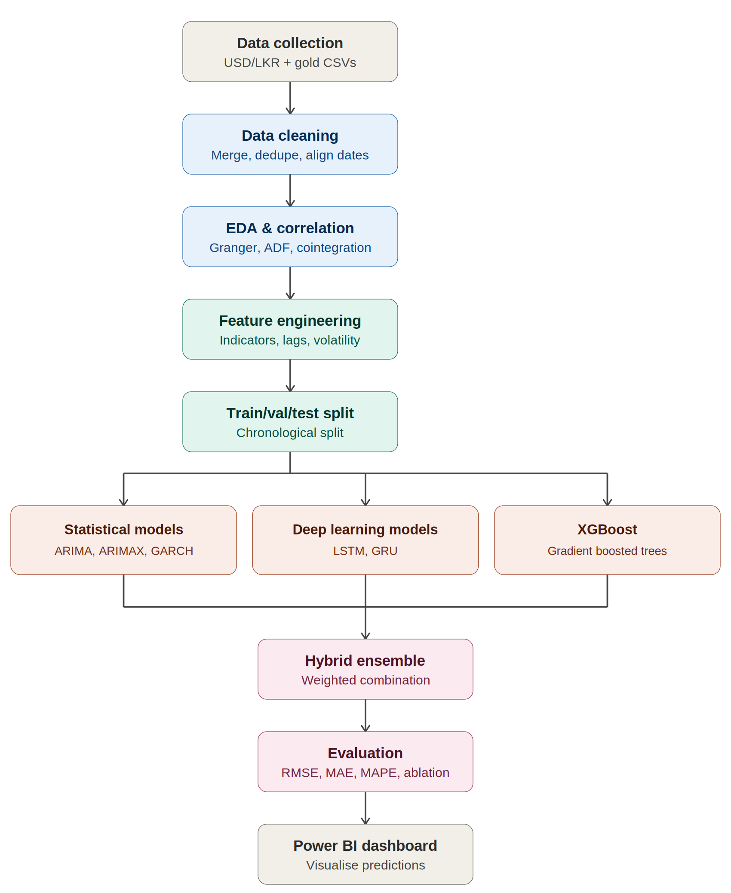
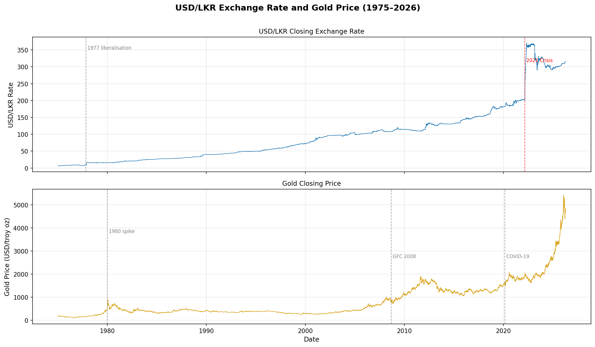

### Project Title
#### A Model to Forecast USD/LKR Exchange Rate: A Multi-Stage Hybrid Ensemble Architecture

### Project Flowchart

### Data sets 

This project uses two datasets: historical USD/LKR exchange rate data sourced from [Investing.com](https://www.investing.com/currencies/usd-lkr-historical-data), covering 2 January 1975 to 16 April 2026, and historical gold price (XAUUSD) data sourced from [Stooq](https://stooq.com/q/?s=xauusd), with underlying commodity pricing provided by Barchart, covering 1 March 1793 to 9 June 2026. 
The two datasets are cleaned, filtered, and merged on matching dates to form a single time-indexed dataset spanning 1975 to 2026, which is used throughout the data analysis and modelling stages of the project. 
Further details on each dataset are documented in [raw.md](data/raw.md), and the final merged dataset is documented in [processed.md](data/processed.md) and saved as [usd_lkr_gold_cleaned.csv](data/usd_lkr_gold_cleaned.csv). This contains 12,680 rows spanning 2 January 1975 to 16 April 2026, with eight columns: 
1. lkr_close - The closing price of USD/LKR at the end of that trading day - e.g. 71.50 means 1 USD = 71.50 Sri Lankan Rupees at market close. This is the main target variable for forecasting
2. lkr_open - The opening price at the start of that trading day
3. lkr_high - The highest rate reached during that day
4. lkr_low - The lowest rate reached during that day
5. gold_open - Gold price in USD per troy ounce at market open that day
6. gold_high - Highest gold price reached during that day
7. gold_low - Lowest gold price reached during that day
8. gold_close - Gold price at market close - this is the main gold feature for modelling

### USD/LKR Exchange Rate and Gold Price Overview (1975–2026)

#### Interpretation

##### USD/LKR Closing Exchange Rate

From 1975 to 1977, the exchange rate remained almost completely flat at approximately 7–8 LKR per USD, reflecting the fixed/pegged exchange rate policy maintained by the Central Bank of Sri Lanka during this period. The 1977 liberalisation marks the point at which Sri Lanka shifted to a more market-determined exchange rate system, after which the series begins a gradual upward trend rather than remaining flat. From 1977 to approximately 2020, the depreciation of the LKR is steady and largely linear, rising from around 8 to roughly 180 LKR per USD over more than four decades — consistent with typical gradual currency depreciation in a developing economy. The 2022 crisis then produces a near-vertical spike to approximately 360 LKR per USD, by far the most extreme and abrupt movement across the entire 50-year history. Viewed against this longer timeframe, the 2022 crisis represents a genuine structural break rather than ordinary volatility, and should be treated as such during model development and evaluation.

##### Gold Closing Price

The 1980 spike is clearly visible, where gold rose sharply toward $800/oz driven by the Iranian Revolution and the Soviet invasion of Afghanistan, before falling back through the 1980s and 1990s. Gold prices remained relatively low and stable (roughly $300–400/oz) throughout the 1990s. The Global Financial Crisis (GFC) of 2008 marks the beginning of a major bull run, with gold rising from approximately $700 to nearly $1,900/oz by 2011–2012, followed by a correction through the mid-2010s. The COVID-19 pandemic triggered a further surge, after which gold continued climbing aggressively into the 2020s, reaching over $5,000/oz by 2026 — roughly six times its 2008 pre-crisis level.

##### Combined Interpretation

The period from 2022 onward is the only point in the 50-year history where both series exhibit extreme, simultaneous movement: the LKR collapsing sharply while gold continues its aggressive ascent. Viewed against the full historical record, this co-movement during a period of acute economic stress stands out as unusual relative to the long-run relationship between the two series, providing supporting evidence for the safe-haven hypothesis underpinning the inclusion of gold as a predictive feature in this project.

##### The Relationship Between the Two

Look at the two panels together at the major crisis points:

- **1980 spike** → gold surges sharply on geopolitical shocks (Iranian Revolution, Soviet invasion of Afghanistan), while the LKR — still in the early post-liberalisation period — shows only mild movement, since global gold shocks had limited direct channels into the still-developing Sri Lankan economy at the time
- **2008 GFC** → gold surges sharply while the LKR also shows a noticeable uptick in its rate of depreciation — both react to the same global risk-off shock
- **2020 COVID** → same pattern repeats — gold hits new highs, while the LKR continues depreciating at a steady pace, slightly more pronounced than the pre-2020 trend
- **2022 crisis** → the LKR collapses catastrophically, the most extreme move in the entire 50-year history. Gold was already in a strong upward trend, consistent with the safe-haven theory cited in the proposal — global investors had already been moving toward gold before the LKR crisis fully unfolded

***This visual already provides strong intuitive support for argument that gold carries predictive signal for LKR movements — both series respond to the same global economic stress events.
