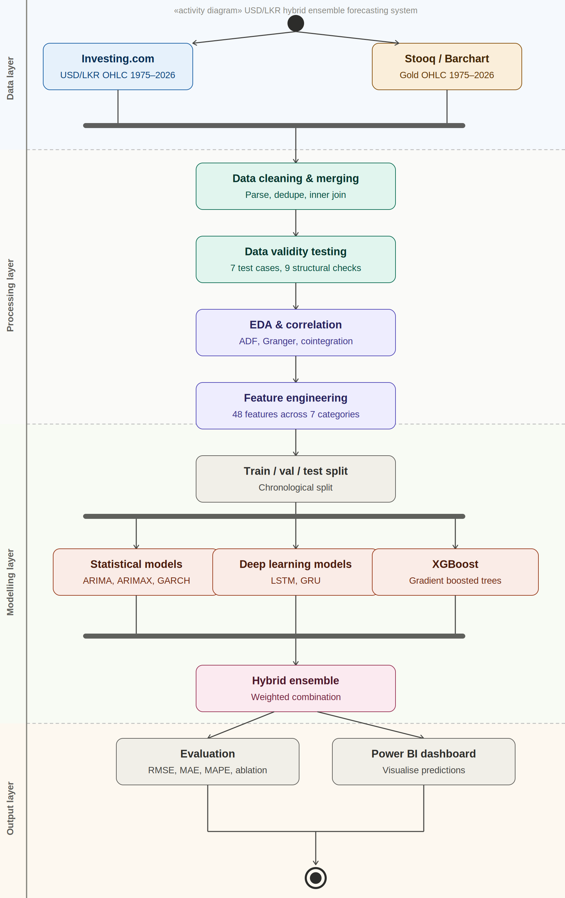
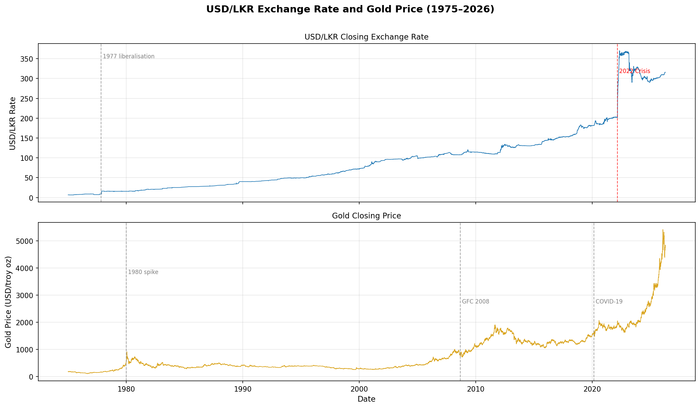

### Project Title
#### A Model to Forecast USD/LKR Exchange Rate: A Multi-Stage Hybrid Ensemble Architecture

### Project Flowchart

### Data sets 

This project uses two datasets: historical USD/LKR exchange rate data sourced from [Investing.com](https://www.investing.com/currencies/usd-lkr-historical-data), covering 2 January 1975 to 16 April 2026, and historical gold price (XAUUSD) data sourced from [Stooq](https://stooq.com/q/?s=xauusd), with underlying commodity pricing provided by Barchart, covering 1 March 1793 to 9 June 2026. 
The two datasets are cleaned, filtered, and merged on matching dates to form a single time-indexed dataset spanning 1975 to 2026, which is used throughout the data analysis and modelling stages of the project. 
Further details on each dataset are documented in [raw.md](data/raw.md), and the final merged dataset is documented in [processed.md](data/processed.md) and saved as [usd_lkr_gold_cleaned.csv](data/usd_lkr_gold_cleaned.csv). This contains 12,680 rows spanning 2 January 1975 to 16 April 2026, with eight columns: 
1. lkr_close - The closing price of USD/LKR at the end of that trading day - e.g. 71.50 means 1 USD = 71.50 Sri Lankan Rupees at market close. This is the main target variable for forecasting
2. lkr_open - The opening price at the start of that trading day
3. lkr_high - The highest rate reached during that day
4. lkr_low - The lowest rate reached during that day
5. gold_open - Gold price in USD per troy ounce at market open that day
6. gold_high - Highest gold price reached during that day
7. gold_low - Lowest gold price reached during that day
8. gold_close - Gold price at market close - this is the main gold feature for modelling

#### Data Validity Testing

After merging the USD/LKR and gold datasets, a set of automated validity tests were run to confirm the merged file is correct. Seven dates were picked from across the full 1975–2026 date range, their values were retrieved from the originalraw source files, and then compared against the same dates in the merged dataset. All values matched exactly. Nine additional structural checks confirmed no missing values, no duplicate dates, correct row count (12,680), sorted chronological index, and correct start and end dates. All 16 tests passed.

The test code is included at the end of [Cleaning_Merging.ipynb](code/Cleaning_Merging.ipynb).

### USD/LKR Exchange Rate and Gold Price Overview (1975–2026)

#### Interpretation

##### USD/LKR Closing Exchange Rate

From 1975 to 1977, the exchange rate remained almost completely flat at approximately 7–8 LKR per USD, reflecting the fixed/pegged exchange rate policy maintained by the Central Bank of Sri Lanka during this period. The 1977 liberalisation marks the point at which Sri Lanka shifted to a more market-determined exchange rate system, after which the series begins a gradual upward trend rather than remaining flat. From 1977 to approximately 2020, the depreciation of the LKR is steady and largely linear, rising from around 8 to roughly 180 LKR per USD over more than four decades — consistent with typical gradual currency depreciation in a developing economy. The 2022 crisis then produces a near-vertical spike to approximately 360 LKR per USD, by far the most extreme and abrupt movement across the entire 50-year history. Viewed against this longer timeframe, the 2022 crisis represents a genuine structural break rather than ordinary volatility, and should be treated as such during model development and evaluation.

##### Gold Closing Price

The 1980 spike is clearly visible, where gold rose sharply toward $800/oz driven by the Iranian Revolution and the Soviet invasion of Afghanistan, before falling back through the 1980s and 1990s. Gold prices remained relatively low and stable (roughly $300–400/oz) throughout the 1990s. The Global Financial Crisis (GFC) of 2008 marks the beginning of a major bull run, with gold rising from approximately $700 to nearly $1,900/oz by 2011–2012, followed by a correction through the mid-2010s. The COVID-19 pandemic triggered a further surge, after which gold continued climbing aggressively into the 2020s, reaching over $5,000/oz by 2026 - roughly six times its 2008 pre-crisis level.

##### Combined Interpretation

The period from 2022 onward is the only point in the 50-year history where both series exhibit extreme, simultaneous movement: the LKR collapsing sharply while gold continues its aggressive ascent. Viewed against the full historical record, this co-movement during a period of acute economic stress stands out as unusual relative to the long-run relationship between the two series, providing supporting evidence for the safe-haven hypothesis underpinning the inclusion of gold as a predictive feature in this project.

##### The Relationship Between the Two

Look at the two panels together at the major crisis points:

- **1980 spike** → gold surges sharply on geopolitical shocks (Iranian Revolution, Soviet invasion of Afghanistan), while the LKR - still in the early post-liberalisation period - shows only mild movement, since global gold shocks had limited direct channels into the still-developing Sri Lankan economy at the time
- **2008 GFC** → gold surges sharply while the LKR also shows a noticeable uptick in its rate of depreciation - both react to the same global risk-off shock
- **2020 COVID** → same pattern repeats - gold hits new highs, while the LKR continues depreciating at a steady pace, slightly more pronounced than the pre-2020 trend
- **2022 crisis** → the LKR collapses catastrophically, the most extreme move in the entire 50-year history. Gold was already in a strong upward trend, consistent with the safe-haven theory cited in the proposal - global investors had already been moving toward gold before the LKR crisis fully unfolded

***This visual already provides strong intuitive support for argument that gold carries predictive signal for LKR movements — both series respond to the same global economic stress events.
### EDA findings:
1. Both price series are non-stationary - confirmed ADF tests confirm both raw price series have a unit root (p ≈ 1.0 for gold, p = 0.97 for LKR). Log returns are stationary for both (p ≈ 0.00). All models will be trained on log returns, and ARIMA will use d=1 differencing.
2. The LKR distribution shows clear regime changes LKR returns are extremely leptokurtic (skew ≈ 53, kurtosis ≈ 4,650) - driven by the 1975–1977 fixed exchange rate period and the 2022 crisis. This confirms the series contains genuine structural breaks that the models must account for.
3. Volatility clustering confirmed in both series Both series exhibit clear volatility clustering — large moves cluster together. This directly justifies the inclusion of GARCH for time-varying volatility modelling in the hybrid architecture.
4. No significant linear relationship between gold and LKR returns Spearman correlation on log returns is r = −0.014 (p = 0.11) — not significant. Granger causality is not significant at any lag from 1 to 5 across the full 50-year history.
5. Key finding — the relationship is crisis-dependent, not constant The earlier marginal Granger significance at lags 3–5 (observed in the 2000–2022 subset) disappears when tested over the full history. This suggests gold's predictive relationship with LKR intensifies specifically during global stress events (1980, 2008, 2020, 2022) rather than being a stable everyday effect. The rolling correlation plot clearly shows this - the correlation oscillates between positive and negative and spikes during crises.
6. This strengthens the case for the hybrid model A simple linear model would fail to capture this crisis-dependent, regime-switching relationship. The findings directly justify the LSTM/GRU/XGBoost architecture — these models can learn non-linear, time-varying patterns that a linear Granger test or ARIMA alone cannot detect.
   
### After considering EDA Final Conclusion:
Across the full 50-year history, gold shows no stable, always-present linear relationship with LKR - the earlier marginal. Granger result was specific to the 2000-2022 window and likely driven by the 2022 crisis period. The relationship instead appears to be regime-dependent, intensifying during global stress events. This further strengthens the case for a flexible hybrid model(LSTM/GRU/XGBoost) capable of learning crisis-dependent, non-linear patterns, rather than a simple linear model assuming a constant gold-LKR relationship across all market regimes.

### Feature Engineering

The feature engineering notebook [Feature_engineering.ipynb](code/Feature_engineering.ipynb) transforms the cleaned merged dataset of 12,680 daily observations into a rich set of 48 input features across seven categories, ready for model training. The full process is described below.

#### Why Feature Engineering?

Raw price data alone is not sufficient for machine learning models to learn meaningful patterns. Feature engineering creates additional signals from the raw data - capturing trend direction, momentum, volatility, and delayed relationships - giving the models a much richer and more informative view of market behaviour on any given day.

#### Features Created

**Log Returns** - Log returns were computed for both the USD/LKR closing price and the gold closing price using the formula log(Pt / Pt-1). Log returns convert the non-stationary raw price series into stationary daily percentage changes, which is a prerequisite for ARIMA-based modelling and ensures consistent gradient behaviour in deep learning models.

**USD/LKR Technical Indicators** - Six families of technical indicators were derived from the USD/LKR OHLC data: Simple Moving Averages (SMA-10, SMA-30) to capture trend direction; Exponential Moving Averages (EMA-10, EMA-30) which weight recent prices more heavily; RSI-14 (momentum oscillator ranging 0–100); MACD with signal line and histogram (trend-following momentum); Bollinger Bands (upper, lower, and width - measuring volatility regime); and ATR-14 (average daily trading range volatility).

**Gold Technical Indicators** - The same set of indicators (SMA-10, SMA-30, RSI-14, MACD, Bollinger Band width, ATR-14) was also derived from the gold OHLC data. Gold's own momentum and volatility signals may carry predictive information for the LKR beyond the raw gold price level alone - particularly during periods where gold's internal dynamics precede broader market stress.

**Lagged Gold Features** - Gold closing price and gold log returns were lagged by 1 to 5 days, creating 10 lagged features in total. This allows the models to detect any delayed effect of gold price movements on the USD/LKR rate, motivated by the crisis-dependent relationship identified in the Granger causality analysis.

**Rolling Volatility Features** - The rolling standard deviation of log returns was computed over 10-day and 30-day windows for both series (lkr_vol_10, lkr_vol_30, gold_vol_10, gold_vol_30). These features give the models explicit information about how turbulent the recent market environment has been, directly capturing the volatility clustering patterns observed in the EDA stage.

**Calendar Features** - Day of the week (0=Monday, 4=Friday), month (1–12), and quarter (1–4) were included to capture any residual seasonal or day-of-week patterns in exchange rate behaviour not already captured by the technical indicators.

**Target Variables** - Two target variables were created by shifting the series forward by one day: `target_lkr_returns` (next day's log return) and `target_lkr_close` (next day's closing price).

#### Feature Summary

| Category | Count |
|---|---|
| Log returns | 2 |
| LKR technical indicators | 12 |
| Gold technical indicators | 7 |
| Lagged gold features | 10 |
| Rolling volatility | 4 |
| Calendar features | 3 |
| Raw OHLC (retained) | 8 |
| Target variables | 2 |
| **Total** | **48** |

#### Output

After removing 30 rows at the start of the dataset attributable to rolling window warm-up periods and 1 row at the end due to the one-day forward shift on the target variable, the final feature-engineered dataset contains **12,646 rows and 48 columns** with no missing values, saved to `data/processed/usd_lkr_gold_features.csv`.

Finally, added **calendar features** (day of the week, month, and quarter) to capture any seasonal patterns, and created the **target variables** - the next day's USD/LKR closing price and log return - which are what the models will learn to predict.

After removing a small number of rows at the start and end of the dataset that could not be computed due to rolling window warm-up periods, the final feature-engineered dataset contains **12,646 rows and 48 columns**, ready for model training and saved as [usd_lkr_gold_features.csv](data/usd_lkr_gold_features.csv) in Google Drive.

### Model Development 
[Model.ipynb](code/Model.ipynb)

This notebook implements the full model development pipeline for the hybrid ensemble forecasting system, covering six individual models across three stages.

**Stage 1 - Statistical models:** ARIMA (univariate baseline) is fitted using auto_arima with AIC-based order selection, identifying ARIMA(1,1,5) as the optimal specification. ARIMAX extends ARIMA by incorporating gold log returns and lagged gold returns at days 3 and 5 as exogenous regressors. GARCH(1,1) is fitted on ARIMA residuals to model time-varying volatility and generate confidence intervals for the final ensemble.

**Stage 2 - Deep learning models:** LSTM and GRU networks are trained on 30-day lookback sequences using a two-layer architecture (64+32 units), RMSprop optimiser, and early stopping with patience of 10 epochs.

**Stage 3 - Gradient-boosted trees:** XGBoost is trained on the full flat feature set (500 trees, max depth 4) with early stopping on validation RMSE.

All models are evaluated on the held-out test set (2022–2026) using RMSE and MAE. 

### Individual Model Results (Test Set 2022–2026)

| Model | RMSE | MAE |
|---|---|---|
| ARIMA | 0.007943 | 0.002872 |
| GARCH(1,1) | 0.007943 | 0.002872 |
| XGBoost | 0.007960 | 0.002923 |
| ARIMAX | 0.008019 | 0.003293 |
| LSTM | 0.014709 | 0.008308 |
| GRU | 0.038416 | 0.032279 |

Results revealed that the statistical models outperformed the deep learning models on this dataset. ARIMA achieved the lowest RMSE (0.007943) and MAE (0.002872), establishing a strong statistical baseline. XGBoost produced comparable results (RMSE: 0.007960), confirming that gradient boosted trees can match classical statistical models for this exchange rate pair. ARIMAX marginally underperformed ARIMA despite the addition of gold features, which is consistent with the Granger causality findings in the EDA stage, the gold-LKR relationship is non-linear and therefore not fully captured by a linear exogenous regressor. Both LSTM and GRU underperformed the statistical baselines, with early stopping triggering at epoch 20 and epoch 10 respectively, suggesting the models were undertrained given the relatively short validation period (775 rows) and the structural break introduced by the 2022 Sri Lanka economic crisis, an extreme out-of-distribution event with no historical precedent in the 43-year training set. These individual model limitations directly motivate the hybrid ensemble in the next stage, where combining predictions from all models is expected to produce a more robust and accurate forecast than any single model alone.

