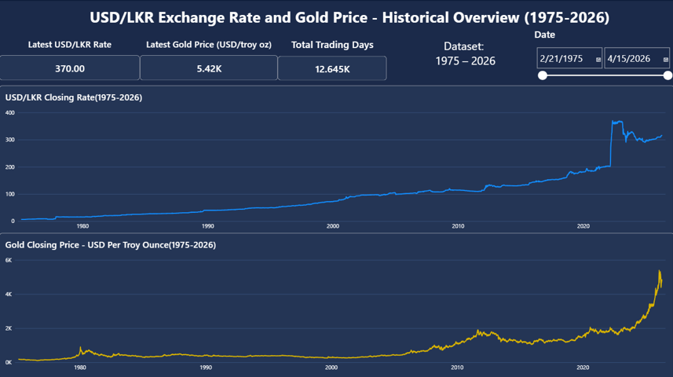
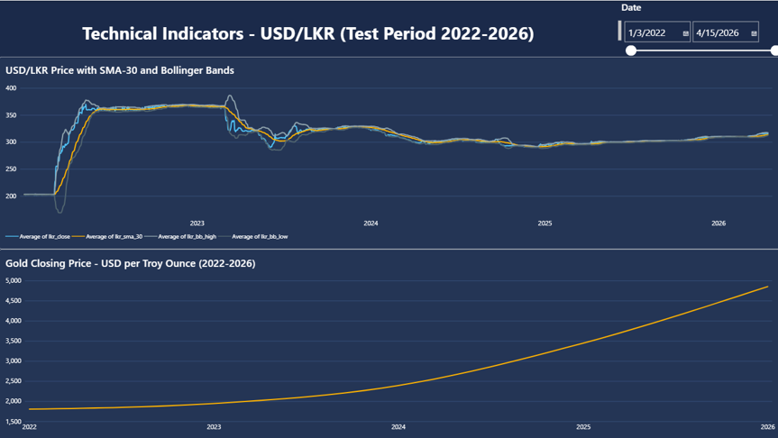
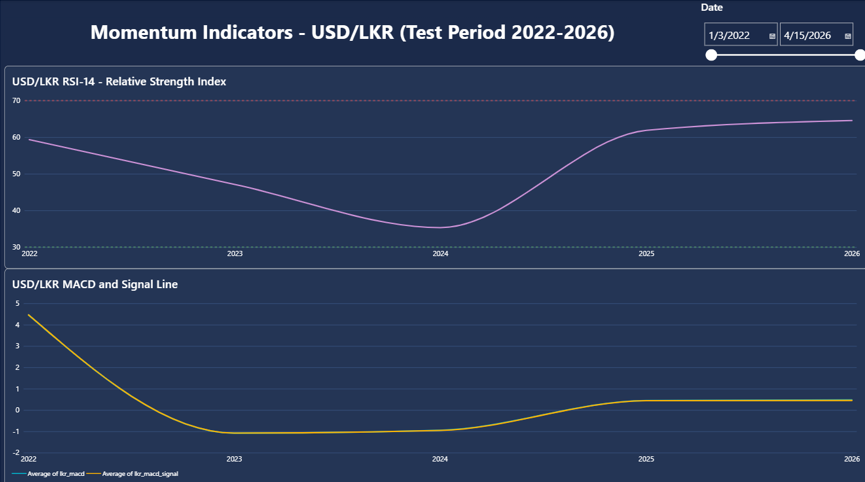
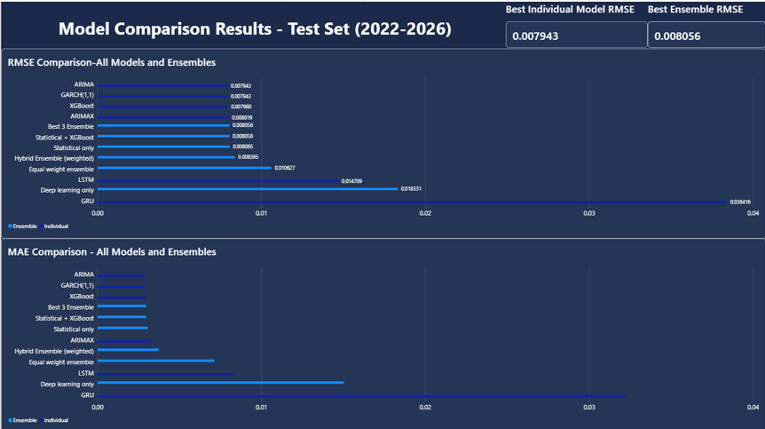
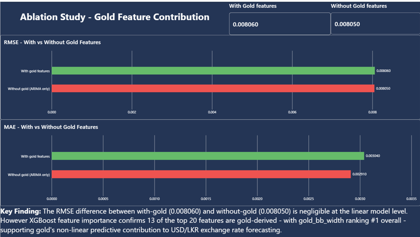

# Power BI Dashboard - USD/LKR Exchange Rate Forecasting

This folder contains the interactive Power BI dashboard and all CSV data files used to build it.

## Files

| File | Description |
|---|---|
| `USD_LKR_Forecasting_Dashboard.pbix` | Power BI dashboard file |
| `01_predictions.csv` | Actual vs predicted returns + GARCH confidence intervals |
| `02_historical_prices.csv` | Full 1975–2026 USD/LKR and gold price history |
| `03_technical_indicators.csv` | RSI, MACD, Bollinger Bands (test period 2022–2026) |
| `04_model_results.csv` | RMSE and MAE for all 12 models and ensembles |
| `05_ablation_study.csv` | With-gold vs without-gold comparison |

## Dashboard Pages

**Page 1 - Historical Overview (1975-2026)**

Displays 50 years of USD/LKR and gold price history with KPI cards showing latest rates, total trading days, and dataset range. Interactive date slicer allows filtering to any custom period.

**Page 2 - Price and Volatility (2022–2026)**

Shows USD/LKR closing price with SMA-30 and Bollinger Bands alongside gold price during the test period. Bollinger Bands visibly widen during the 2022 crisis and narrow post-2023, confirming the volatility regime shift captured by the feature engineering stage.

**Page 3 - Momentum Indicators (2022-2026)**

Displays RSI-14 with overbought (70) and oversold (30) reference lines, and MACD with signal line -the same technical indicators used as model input features in the hybrid ensemble.

**Page 4 - Model Comparison Results**

Ranks all 12 models and ensemble combinations by RMSE and MAE using horizontal bar charts. KPI cards highlight the best individual model (ARIMA, RMSE: 0.007943) and best ensemble (Best 3, RMSE: 0.008056).

**Page 5 - Ablation Study: Gold Feature Contribution**

Compares forecasting accuracy with gold features (RMSE: 0.008060) against without gold features (RMSE: 0.008050) using green and red bar charts. Key Finding text box explains that despite negligible linear RMSE difference, 13 of the top 20 XGBoost features are gold-derived, confirming gold's non-linear predictive contribution.

## How to Open

1. Download `USD_LKR_Forecasting_Dashboard.pbix`
2. Open with [Power BI Desktop](https://powerbi.microsoft.com/desktop)
   (free download - no sign-in required for local viewing)
3. The dashboard loads with all 5 CSV files pre-connected
4. Use the date slicers on each page to explore different time periods
